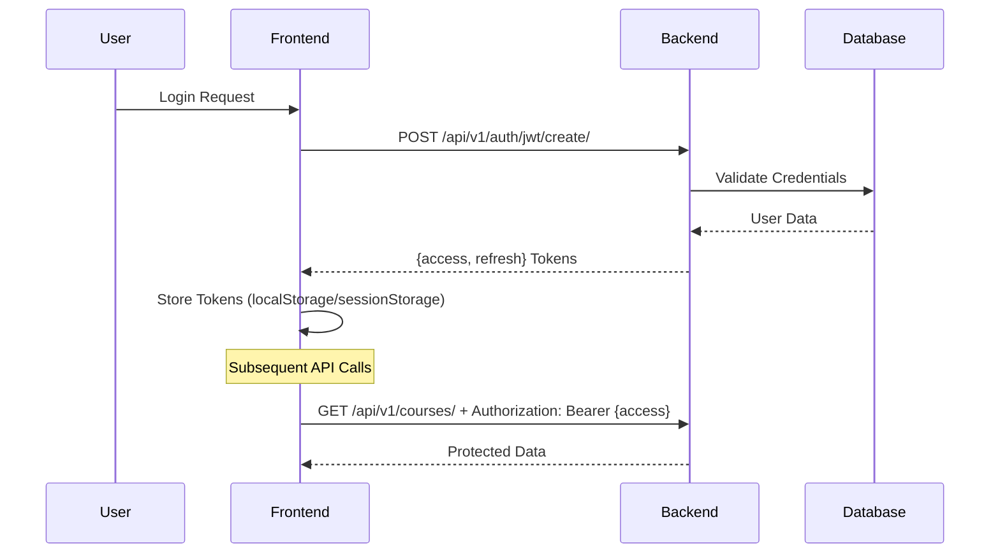

# Devangwa Platform - Integration Guide

This guide provides comprehensive information for developers integrating with or extending the Devangwa Coaching platform. Covers API usage, authentication flows, data models, and best practices.

## 🏗 System Architecture

### High-Level Overview

```
┌─────────────────┐    HTTP/HTTPS    ┌─────────────────┐
│   Vue.js SPA    │◄────────────────►│ Django REST API │
│   (Frontend)    │                  │   (Backend)     │
└─────────────────┘                  └─────────────────┘
         │                                   │
         │                                   │
         ▼                                   ▼
┌─────────────────┐                  ┌─────────────────┐
│   Nginx Proxy   │                  │   PostgreSQL    │
│                 │                  │   Database      │
└─────────────────┘                  └─────────────────┘
```

### Component Interaction Flow

1. **User Request** → Vue.js Component
2. **API Call** → Axios → Django REST Framework
3. **Authentication** → JWT Token Validation
4. **Business Logic** → Django Models/Services
5. **Database** → PostgreSQL Queries
6. **Response** → JSON → Vue.js State Update

## 🔐 Authentication & Authorization

### JWT Token Flow



### Token Management

#### Frontend Implementation
```javascript
// services/authService.js
const api = axios.create({
  baseURL: import.meta.env.VITE_API_URL || '/api/v1/',
  headers: { 'Content-Type': 'application/json' }
});

// Request interceptor - Add auth token
api.interceptors.request.use((config) => {
  const token = localStorage.getItem('auth_token');
  if (token) {
    config.headers.Authorization = `Bearer ${token}`;
  }
  return config;
});

// Response interceptor - Handle token refresh
api.interceptors.response.use(
  (response) => response,
  async (error) => {
    if (error.response?.status === 401) {
      // Attempt token refresh
      const refreshToken = localStorage.getItem('refresh_token');
      if (refreshToken) {
        try {
          const refreshResponse = await api.post('auth/jwt/refresh/', {
            refresh: refreshToken
          });
          const newAccess = refreshResponse.data.access;
          localStorage.setItem('auth_token', newAccess);
          // Retry original request
          error.config.headers.Authorization = `Bearer ${newAccess}`;
          return api.request(error.config);
        } catch (refreshError) {
          // Refresh failed, logout user
          logoutAndRedirect();
        }
      }
    }
    return Promise.reject(error);
  }
);
```

#### Backend Implementation
```python
# settings.py
REST_FRAMEWORK = {
    'DEFAULT_AUTHENTICATION_CLASSES': (
        'rest_framework_simplejwt.authentication.JWTAuthentication',
    ),
    'DEFAULT_PERMISSION_CLASSES': [
        'rest_framework.permissions.IsAuthenticated',
    ]
}

SIMPLE_JWT = {
    'ACCESS_TOKEN_LIFETIME': timedelta(days=1),
    'REFRESH_TOKEN_LIFETIME': timedelta(days=7),
}
```

### User Roles & Permissions

| Role | Permissions | Access Level |
|------|-------------|--------------|
| **Student** | View courses, Make payments, Access community | Basic |
| **Instructor** | Create courses, View analytics, Manage content | Elevated |
| **Admin** | Full system access, User management | Complete |

## 📡 API Reference

### Base Configuration

```javascript
const API_CONFIG = {
  baseURL: import.meta.env.VITE_API_URL || '/api/v1/',
  timeout: 10000,
  headers: {
    'Content-Type': 'application/json',
  }
};
```

### Authentication Endpoints

#### User Registration
```http
POST /api/v1/auth/users/
Content-Type: application/json

{
  "full_name": "John Doe",
  "email": "john@example.com",
  "phonenumber": "+1234567890",
  "password": "securepassword123",
  "is_individual": true,
  "is_company": false
}
```

#### User Login
```http
POST /api/v1/auth/jwt/create/
Content-Type: application/json

{
  "email": "john@example.com",
  "password": "securepassword123"
}

Response:
{
  "access": "eyJ0eXAiOiJKV1QiLCJhbGciOiJIUzI1NiJ9...",
  "refresh": "eyJ0eXAiOiJKV1QiLCJhbGciOiJIUzI1NiJ9..."
}
```

#### Get Current User
```http
GET /api/v1/auth/users/me/
Authorization: Bearer {access_token}

Response:
{
  "id": 1,
  "email": "john@example.com",
  "full_name": "John Doe",
  "is_individual": true,
  "is_staff": false
}
```

### Course Management

#### List Courses
```http
GET /api/v1/course/courses/

Query Parameters:
- page: Page number
- search: Search term
- category: Filter by category

Response:
{
  "count": 25,
  "next": "/api/v1/course/courses/?page=2",
  "previous": null,
  "results": [
    {
      "id": 1,
      "title": "Vue.js Masterclass",
      "slug": "vue-js-masterclass",
      "description": "Learn Vue.js from scratch",
      "final_price": 99.99,
      "instructor": {
        "id": 1,
        "full_name": "Jane Instructor",
        "email": "jane@instructor.com"
      },
      "total_videos": 25,
      "total_modules": 5
    }
  ]
}
```

#### Get Course Details
```http
GET /api/v1/course/courses/{slug}/

Response:
{
  "id": 1,
  "title": "Vue.js Masterclass",
  "description": "Complete Vue.js course",
  "final_price": 99.99,
  "modules": [
    {
      "id": 1,
      "title": "Introduction to Vue.js",
      "videos": [
        {
          "id": 1,
          "title": "What is Vue.js?",
          "video_url": "/media/videos/intro.mp4",
          "duration": "10:30"
        }
      ]
    }
  ],
  "faqs": [
    {
      "question": "Do I need prior experience?",
      "answer": "No, this course is for beginners"
    }
  ]
}
```

### Payment Integration

#### Process Payment
```http
POST /api/v1/payments/process-payment/
Authorization: Bearer {access_token}
Content-Type: application/json

{
  "content_type_id": 1,
  "object_id": 1,
  "amount": 99.99,
  "payment_method": "card",
  "phone_number": "+1234567890",
  "card_number": "4111111111111111"
}

Response:
{
  "order_tracking_id": "ORD-2024-001",
  "status": "completed",
  "details": {
    "transaction_id": "TXN-12345",
    "message": "Payment successful"
  }
}
```

## 🗄 Data Models

### User Model
```python
class CustomUser(AbstractBaseUser):
    email = models.EmailField(unique=True)
    full_name = models.CharField(max_length=180)
    phonenumber = models.CharField(max_length=15, unique=True)
    is_individual = models.BooleanField(default=False)
    is_company = models.BooleanField(default=False)
    is_staff = models.BooleanField(default=False)
    is_active = models.BooleanField(default=True)
    created_at = models.DateTimeField(auto_now_add=True)

    USERNAME_FIELD = 'email'
```

### Course Model
```python
class Course(models.Model):
    title = models.CharField(max_length=255)
    slug = models.SlugField(max_length=255, unique=True)
    description = models.TextField(blank=True)
    final_price = models.DecimalField(max_digits=10, decimal_places=2)
    instructor = models.ForeignKey(CustomUser, on_delete=models.CASCADE)
    ispublished = models.BooleanField(default=False)
    created_at = models.DateTimeField(auto_now_add=True)
    updated_at = models.DateTimeField(auto_now=True)
```

### Payment Model
```python
class Payment(models.Model):
    user = models.ForeignKey(CustomUser, on_delete=models.CASCADE)
    amount = models.DecimalField(max_digits=10, decimal_places=2)
    currency = models.CharField(max_length=3, default='TZS')
    status = models.CharField(max_length=20, choices=PAYMENT_STATUS)
    payment_method = models.CharField(max_length=20)
    order_tracking_id = models.CharField(max_length=100, unique=True)
    created_at = models.DateTimeField(auto_now_add=True)
```

## 🔧 Integration Patterns

### Error Handling

#### Frontend Error Handling
```javascript
const handleApiError = (error) => {
  if (error.response) {
    // Server responded with error status
    const { status, data } = error.response;

    switch (status) {
      case 400:
        // Validation errors
        showValidationErrors(data);
        break;
      case 401:
        // Unauthorized - redirect to login
        redirectToLogin();
        break;
      case 403:
        // Forbidden
        showPermissionError();
        break;
      case 404:
        // Not found
        showNotFoundError();
        break;
      case 500:
        // Server error
        showServerError();
        break;
      default:
        showGenericError();
    }
  } else if (error.request) {
    // Network error
    showNetworkError();
  } else {
    // Other error
    showGenericError();
  }
};
```

#### Backend Error Handling
```python
from rest_framework import status
from rest_framework.response import Response
from rest_framework.views import APIView

class CustomAPIView(APIView):
    def handle_exception(self, exc):
        if isinstance(exc, ValidationError):
            return Response(
                {'error': 'Validation failed', 'details': exc.detail},
                status=status.HTTP_400_BAD_REQUEST
            )
        elif isinstance(exc, PermissionDenied):
            return Response(
                {'error': 'Permission denied'},
                status=status.HTTP_403_FORBIDDEN
            )
        return super().handle_exception(exc)
```

### Loading States

#### Frontend Loading Management
```javascript
const useApiCall = () => {
  const loading = ref(false);
  const error = ref(null);
  const data = ref(null);

  const execute = async (apiCall) => {
    loading.value = true;
    error.value = null;

    try {
      const result = await apiCall();
      data.value = result.data;
      return result;
    } catch (err) {
      error.value = err;
      throw err;
    } finally {
      loading.value = false;
    }
  };

  return { loading, error, data, execute };
};
```

### Caching Strategy

#### API Response Caching
```javascript
// Simple in-memory cache
const cache = new Map();

const cachedApiCall = async (key, apiCall, ttl = 300000) => { // 5 minutes
  const cached = cache.get(key);
  if (cached && Date.now() - cached.timestamp < ttl) {
    return cached.data;
  }

  const result = await apiCall();
  cache.set(key, {
    data: result,
    timestamp: Date.now()
  });

  return result;
};

// Usage
const courses = await cachedApiCall(
  'courses',
  () => api.get('course/courses/')
);
```

## 🔒 Security Best Practices

### API Security
- Always use HTTPS in production
- Validate all input data
- Implement rate limiting
- Use proper CORS settings
- Sanitize user inputs
- Implement proper authentication checks

### Frontend Security
- Store tokens securely (httpOnly cookies for sensitive data)
- Validate API responses
- Implement CSRF protection
- Use Content Security Policy
- Sanitize user-generated content

### Data Protection
- Encrypt sensitive data at rest
- Use secure password hashing
- Implement proper access controls
- Regular security audits
- Keep dependencies updated

## 📊 Monitoring & Analytics

### Error Tracking
```python
# settings.py
import sentry_sdk
from sentry_sdk.integrations.django import DjangoIntegration

sentry_sdk.init(
    dsn=os.getenv('SENTRY_DSN'),
    integrations=[DjangoIntegration()],
    traces_sample_rate=1.0,
    send_default_pii=True
)
```

### Performance Monitoring
- API response times
- Database query performance
- Frontend bundle size analysis
- User interaction tracking

## 🚀 Deployment Integration

### Environment Configuration
```bash
# .env.production
DEBUG=False
SECRET_KEY=your-production-secret
ALLOWED_HOSTS=yourdomain.com,www.yourdomain.com
DATABASE_ENGINE=django.db.backends.postgresql
DATABASE_NAME=prod_db
DATABASE_USER=prod_user
DATABASE_PASSWORD=prod_password
DATABASE_HOST=prod-db-host
EMAIL_HOST=smtp.yourdomain.com
SENTRY_DSN=your-sentry-dsn
```

### Docker Integration
```dockerfile
# Multi-stage build
FROM node:18 as frontend-build
WORKDIR /app/frontend
COPY devangwacoaching/ .
RUN npm install && npm run build

FROM python:3.11-slim as backend
WORKDIR /app
COPY devangwabackend/ .
COPY --from=frontend-build /app/frontend/dist ./static/
RUN pip install -r requirements.txt
RUN python manage.py collectstatic --noinput
EXPOSE 8000
CMD ["gunicorn", "devangwa.wsgi", "--bind", "0.0.0.0:8000"]
```

## 🧪 Testing Integration

### API Testing
```python
# tests/test_api.py
import pytest
from rest_framework.test import APITestCase
from django.contrib.auth import get_user_model

class CourseAPITest(APITestCase):
    def setUp(self):
        self.user = get_user_model().objects.create_user(
            email='test@example.com',
            password='testpass123'
        )

    def test_course_list_requires_authentication(self):
        response = self.client.get('/api/v1/course/courses/')
        self.assertEqual(response.status_code, 401)

    def test_course_list_authenticated(self):
        self.client.force_authenticate(user=self.user)
        response = self.client.get('/api/v1/course/courses/')
        self.assertEqual(response.status_code, 200)
```

### Frontend Testing
```javascript
// tests/components/CourseCard.test.js
import { mount } from '@vue/test-utils';
import CourseCard from '@/components/CourseCard.vue';

describe('CourseCard', () => {
  it('displays course information', () => {
    const course = {
      title: 'Test Course',
      final_price: 99.99,
      instructor: { full_name: 'John Doe' }
    };

    const wrapper = mount(CourseCard, {
      props: { course }
    });

    expect(wrapper.text()).toContain('Test Course');
    expect(wrapper.text()).toContain('$99.99');
    expect(wrapper.text()).toContain('John Doe');
  });
});
```

## 📚 Additional Resources

### API Documentation
- Interactive API docs: `/api/docs/` (when configured)
- Postman collection: `/docs/postman_collection.json`

### Development Tools
- Vue DevTools for frontend debugging
- Django Debug Toolbar for backend profiling
- Postman/Insomnia for API testing

### External Integrations
- Payment Gateway API documentation
- Email service provider docs
- CDN configuration guides

## 🤝 Support & Troubleshooting

### Common Issues

#### 401 Unauthorized
- Check JWT token validity
- Verify token refresh logic
- Confirm user authentication status

#### CORS Errors
- Verify CORS_ALLOWED_ORIGINS settings
- Check preflight request handling
- Confirm frontend domain configuration

#### Database Connection Issues
- Verify DATABASE_* environment variables
- Check PostgreSQL server status
- Confirm connection pooling settings

### Getting Help
1. Check application logs
2. Review error monitoring (Sentry)
3. Test API endpoints with curl/Postman
4. Verify environment configuration
5. Check network connectivity

### Performance Optimization
- Implement database indexing
- Use query optimization techniques
- Configure caching layers
- Optimize frontend bundle size
- Implement CDN for static assets

This integration guide provides the foundation for working with the Devangwa platform. For specific implementation details, refer to the individual component documentation and codebase.</content>
<parameter name="filePath">/Users/codexl-008/devangwa/devangwabackend/INTEGRATION_GUIDE.md